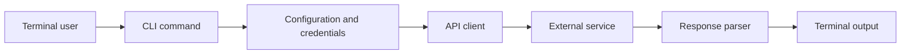

<!-- unified-readme:start -->
<div align="center">

# Cookidoo CLI

**CLI tool for interacting with the Cookidoo recipe platform.**

Build. Automate. Share.

[](https://github.com/JayRHa/CookidooCLI/stargazers)
[](https://github.com/JayRHa/CookidooCLI/network/members)
[](https://github.com/JayRHa/CookidooCLI/issues)
[](https://github.com/JayRHa/CookidooCLI/graphs/contributors)

<h1>Cookidoo CLI</h1>
  <p><strong>Thermomix recipes, shopping lists, and meal plans from your terminal.</strong></p>
  <p>
    
    
    
    
  </p>

---

`CLI Tool` | `Python` | `Public` | `Maintained`

</div>

## What is this?

Cookidoo CLI wraps a service or workflow in a command-line interface so common tasks can be automated from a terminal, shell script, or scheduled job.

## Project Context

- Primary stack: Python.
- Typical usage starts with local configuration or credentials, then executes commands against the target service API.
- This repository is maintained as a practical project and reference asset.

## How It Works

The CLI parses user input, loads configuration, calls the external service, normalizes the response, and prints script-friendly output.



## Quick Start

1. Review the project context and workflow below.
2. Clone the repository:

   ```bash
   git clone https://github.com/JayRHa/CookidooCLI.git
   ```

3. Continue with the setup, usage, or workflow sections below.

---
<!-- unified-readme:end -->

## Overview

`cookidoo` is a high-signal command line tool for:

- viewing and managing your Cookidoo shopping list
- browsing recipe details with ingredients, times, and categories
- checking your weekly meal plan
- browsing managed and custom recipe collections
- clean machine-readable JSON for pipelines

## 60-Second Quickstart

```bash
python3 -m venv .venv
source .venv/bin/activate
python3 -m pip install -e .
export COOKIDOO_EMAIL="your@email.com"
export COOKIDOO_PASSWORD="your_password"

cookidoo user
cookidoo shopping
cookidoo recipe --id r59322
cookidoo calendar
```

## Why It Feels Great To Use

- Single command surface: `cookidoo`
- Strict argument validation with clear errors
- Human view for operators, JSON view for automation
- Full shopping list management (add, remove, check, clear)
- Predictable exit codes for CI and scripts

## Install

```bash
python3 -m pip install -e .
```

If your Python is externally managed, use a virtualenv (recommended).

## Authentication

Use one of these:

```bash
cookidoo --email "you@mail.com" --password "secret" user
```

```bash
export COOKIDOO_EMAIL="you@mail.com"
export COOKIDOO_PASSWORD="secret"
cookidoo user
```

## Command Matrix

| Command | Purpose | Common flags |
| --- | --- | --- |
| `user` | Show user info and subscription | `--json` |
| `shopping` | Show shopping list | `--json` |
| `shopping-recipes` | Show recipes on the shopping list | `--json` |
| `shopping-add` | Add items to shopping list | `--items`, `--recipe-ids` |
| `shopping-remove` | Remove items from shopping list | `--ids`, `--recipe-ids` |
| `shopping-check` | Check/uncheck items | `--ids`, `--type`, `--uncheck` |
| `shopping-clear` | Clear entire shopping list | - |
| `recipe` | Get recipe details | `--id`, `--json` |
| `calendar` | Show weekly meal plan | `--date`, `--json` |
| `collections` | List recipe collections | `--type`, `--page`, `--json` |

## Usage Examples

### User info

```bash
cookidoo user
cookidoo user --json
```

### Shopping list

```bash
cookidoo shopping
cookidoo shopping --json
cookidoo shopping-recipes
```

### Add items to shopping list

```bash
cookidoo shopping-add --items "Milch" "Brot" "Eier"
cookidoo shopping-add --recipe-ids r59322 r12345
```

### Remove items

```bash
cookidoo shopping-remove --ids a1b2c3
cookidoo shopping-remove --recipe-ids r59322
```

### Check/uncheck items

```bash
cookidoo shopping-check --ids i1 i2 i3
cookidoo shopping-check --ids i1 --uncheck
cookidoo shopping-check --ids a1 --type additional
```

### Clear shopping list

```bash
cookidoo shopping-clear
```

### Recipe details

```bash
cookidoo recipe --id r59322
cookidoo recipe --id r59322 --json
```

### Meal plan

```bash
cookidoo calendar
cookidoo calendar --date 2025-03-10
cookidoo calendar --json
```

### Collections

```bash
cookidoo collections
cookidoo collections --type custom
cookidoo collections --type managed --page 1 --json
```

## Automation Recipes

Get subscription type:

```bash
cookidoo user --json | jq -r '.user.subscription.type'
```

Unchecked shopping items as plain list:

```bash
cookidoo shopping --json | jq -r '.ingredients[] | select(.is_owned == false) | .name'
```

Recipe names for today:

```bash
cookidoo calendar --json | jq -r '.calendar[0].recipes[].name'
```

## Exit Codes

| Code | Meaning |
| --- | --- |
| `0` | Success |
| `1` | API/network/runtime error |
| `2` | Input/auth/config error |

## Troubleshooting

`Input error: Email missing`
Use `--email` or set `COOKIDOO_EMAIL`.

`Input error: Password missing`
Use `--password` or set `COOKIDOO_PASSWORD`.

`Error: Authentication failed`
Check your email/password and ensure your Cookidoo account is active.

`Error: Invalid configuration`
Check `--country` and `--language` values. Use valid codes like `ch`/`de-CH`.

`Error while calling Cookidoo API`
Network issue or Cookidoo servers unavailable. Retry later.

## Developer Notes

Run from source:

```bash
PYTHONPATH=src python3 -m cookidoo_cli --help
```

Compile check:

```bash
python3 -m compileall -q src tests
```

Tests:

```bash
PYTHONPATH=src python3 -m pytest -q
```

## Project Structure

```text
src/cookidoo_cli/
  cli.py           # parsing, command execution, output rendering
  transform.py     # normalization layer (dataclass -> dict)
  const.py         # subscription type mappings and defaults
  __main__.py      # python -m entrypoint
tests/
  test_transform.py
```

## Security

- Never commit credentials.
- Prefer environment variables in CI/CD.
- Rotate passwords immediately if exposed.
